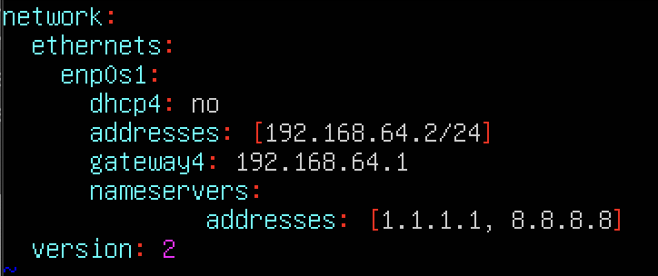
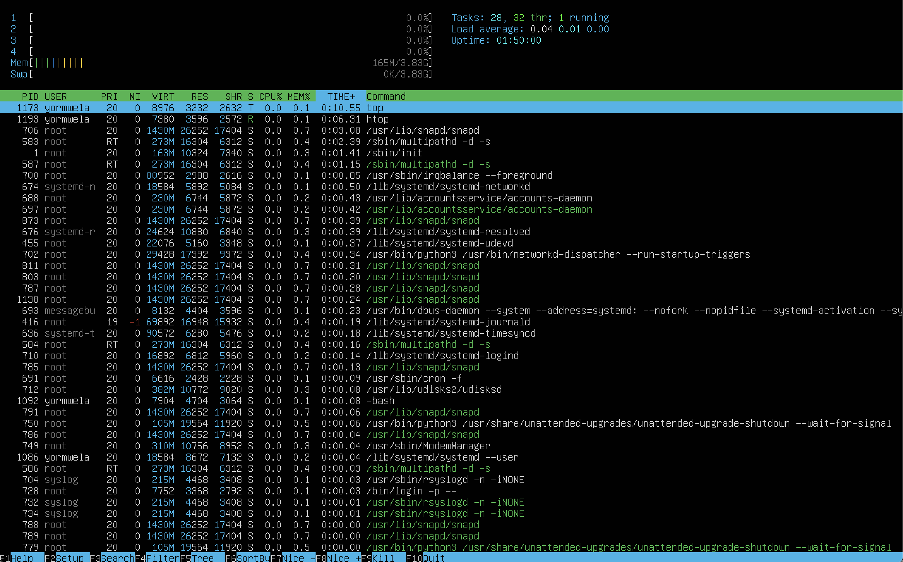

# Отчёт по проекту «Операционные системы UNIX/Linux (Базовый)».

## Содержание

1. *[Установка ОС](#part-1)*
2. *[Создание пользователя](#part-2)*
3. *[Настройка сети ОС](#part-3)*
4. *[Обновление ОС](#part-4)*
5. *[Использование команды  sudo](#part-5)*
6. *[Установка и настройка службы времени](#part-6)*
7. *[Установка и использование текстовых редакторов](#part-7)*
8. *[Установка и базовая настройка сервиса SSHD](#part-8)*
9. *[Установка и использование утилит top, htop](#part-9)*
10. *[Использование утилиты fdisk](#part-10)*
11. *[Использование утилиты df](#part-11)*
12. *[Использование утилиты du](#part-12)*
13. *[Установка и использование утилиты ncdu](#part-13)*
14. *[Работа с системными журналами](#part-14)*
15. *[Использование планировщика заданий CRON](#part-15)*

## Part 1.

- ##### Проверка версии `Ubuntu`:

## Part 2.

- ##### Cоздание пользователя `yormwela` и добавление в группу `adm`: 

- ##### Вывод команды `/etc/passwd`:

## Part 3.
1. ##### Задал название машины вида `yormwela-1` исользуя команду `hostnamectl set-hostname yormwela-1`

2. ##### Установил временную зону исользуя команду `timedatectl set-timezone Europe/Moscow`:
    

3. ##### Вывод сетевых интерфейсов с помощью кольнсольной программы `ifconfig`:
- lo(loopback) - Локальная петля.Служит для подлкючения по сети к этому же компьютеру и не требует дополнительной настройки.

4. ##### Используя консольную команду `hostname -I` получил ip адрес устройства, на котором работаю, от DHCP сервера:
- DHCP(Dynamic Host Configuration Protocol) -  сетевой протокол, позволяющий сетевым устройствам автоматически получать IP-адрес и другие параметры, необходимые для работы в сети `TCP/IP`. Где `TCP/IP` - сетевая модель передачи данных, представленных в цифровом виде.

5. ##### Определил и вывел на экран внешний ip-адрес шлюза (ip) и внутренний IP-адрес шлюза, он же ip-адрес по умолчанию (gw).

6. ##### Задал статичные (заданные вручную, а не полученные от DHCP сервера) настройки ip, gw, dns (используя публичные DNS серверы, например 1.1.1.1 или 8.8.8.8).
- так же для сохранения настроек использовал команду `sudo netplan apply`

7. ##### Перезагрузил  виртуальную машинуб исвользуя команду `reboot`. Убедился, что статичные сетевые настройки (ip, gw, dns) соответствуют заданным в предыдущем пункте  и пропинговал хосты.
- Успешно пропинговал удалённые хосты `1.1.1.1` и `ya.ru`. В выводе команды присутствуют фразы `0% packet loss`. 

## Part 4.

1. ##### Обновил системные пакеты до последней на момент выполнения задания версии.
- для обновления системных пакетов изначально выполняю команду `sudo apt update`,  которая выполняет обновление репозиториев `ubuntu`.
- затем для установки выполняю команду `sudo apt upgrade` 
- после установки выводим команду из первого пункта для подтверждения обновления

## Part 5.
1. ##### Использование команды sudo
- предоставил пользователю созданному в Part 2. , права суперпользователя , используя команду `sudo usermod -aG sudo yormwela`.
- команда sudo ( substitute user and do, подменить пользователя и выполнить ) позволяет строго определенным пользователям выполнять указанные программы с административными привилегиями без ввода пароля суперпользователя root.
- изменил hostname 

## Part 6.
1. ##### Настроил службу автоматической синхронизации времени.
- использовал команду `timedatectl show`:

## Part 7.
1. ##### Установил текстовые редакторы.
- остальные по аналогии

2. ##### Cоздание файла test_X.txt, где X -- название редактора, в котором создан файл.
- ##### VIM:
- В Vim нужно нажать `i` для начала ввода, ввести текст, затем нажать `Esc` для выхода из режима ввода, далее `:wq` и имя файла для сохранения:

- ##### NANO
- В Nano нужно ввести текст, нажать `Ctrl+X` для выхода из режима ввода, `Y` для сохранения и далее имя файла и `Enter` для выхода:

   
- ##### JOE
- В Joe нужно ввести текст, нажать `Ctrl+K` + `X` для выхода из режима ввода, ввести имя файла и `Enter` для выхода:

3. ##### Отредактировал файлы, заменив никнейм на строку «21 School 21», закрыл файл без сохранения изменений.
- ##### VIM 
- Для выхода из Vim без сохранения нужно нажать `Esc` далее ввести `:q!`:

- ##### NANO
- Для выхода из Nano без сохранения нужно нажать `Ctrl+X` и далее `N`:

   
- ##### JOE
- Для выхода из Joe без сохранения нужно нажать `Ctrl+С` и далее `Y`:

4. ##### Отредактировал файл ещё раз (по аналогии с предыдущим пунктом), а затем освоил функции поиска по содержимому файла (слово) и замены слова на любое другое.
- ##### VIM 

- Для поиска в Vim нажать `Esc` и далее `/`:

- Для замены в Vim `:s/old/new`:

- ##### NANO

- Для поиска в Nano нажать `Ctrl+W`:

- Для замены в Nano нажать `Ctrl+\`, написать то, что нужно заменить, затем `Enter`, далее то, чем заменить, в конце нажать `Y` для сохранения:

   
- ##### JOE

- Для поиска в Joe нажать `Ctrl+K` далее `F` , потом то, что ищем, затем ввести `I`:

- Для замены в Joe нажать `Ctrl+K`, далее `F`, потом что менять, ввести `R`, затем на что менять, в конце `Y` для сохранения:

## Part 8.

1. ##### Установка службы SSHd.

2. ##### Добавление автостарта службы при загрузке системы.
    - Автостарт добавляется автоматически,  в ином случае можно использовать команду `sudo systemctl enable sshd`

3. ##### Перенастроил службу SSHd на порт 2022.
    - для перенастройки открыл через текстовый редактор файл `sudo nano /etc/ssh/sshd_config` и поменял `port 22` на нужное значение

4. ##### Используя команду `ps`, показываю наличие процесса `sshd`. Для этого к команде добавлены ключи `-e` и `-f`.

    - Команда `ps` используется для отображения текущих процессов в системе, а ключ `-ef` используется для определения формата вывода и фильтрации результатов.
    `-e` — отображает все процессы в системе, включая процессы, запущенные от имени всех пользователей.
    `-f` — отображает полную информацию о каждом процессе, включая `PID`, родительский `PID`, пользовательский и системный CPU, использование памяти и другие свойства процесса.
    `grep sshd` — `grep` используется для фильтрации строк вывода команды `ps -ef` и отображения только строк, содержащих "sshd". Это позволяет нам найти процессы, связанные со службой `SSHd`.

5. ##### Перезагрузка системы.
    - Для перезагрузки использовал команду `sudo reboot`.

6. ##### Вывод команды netstat.
    - Вывод содержит `tcp 0 0 0.0.0.0:2022 0.0.0.0:* LISTEN`

- Значение ключей в команде `netstat -tan`:

    - `-t` — отображает только TCP-соединения.
    - `-a` — отображает все соединения и порты, включая слушающие порты.
    - `-n` — отображает порты в числовом формате, без разрешения имён.

- Значение каждого столбца в выводе команды `netstat -tan`:

    - `Proto` — Содержит тип протокола
        - `tcp` — протокол, используемый для соединения.
    - `Recv-Q` — Счётчик байтов не скопированных программой пользователя из этого сокета.
    - `Send-Q` — Счётчик байтов, не подтверждённых удалённым узлом.
    - `Local Address` — Адрес и номер порта локального конца сокета.
        - `0.0.0.0:2022` — локальный IP-адрес и порт, на котором служба `SSHd` слушает входящие соединения.
    - `Foreign Address` — Адрес и номер порта удалённого конца сокета.
        - `0.0.0.0:*` — удалённый IP-адрес и порт.
    - `State` — Состояние сокета.
        - `LISTEN` — Сокет ожидает входящих подключений.
        - `SYN_SENT` — Сокет, находящийся в режиме активной попытки установки подключения.

## Part 9.

1. ##### Запустил утилиту top.

- Отчет по выводу команды `top`:
    - uptime - 36 min.
    - количество авторизованных пользователей - 1.
    - общую загрузку системы (3 величины за последние 1,5,15 минут) - 0.00, 0.00, 0.00. 
    - общее количество процессов - 113
    - загрузку cpu `%Cpu(s): 0.0 us, 0.2 sy, 0.0 ni, 99.8 id, 0.0 wa, 0.0 hi, 0.0 si, 0.0 st`
    - загрузку памяти `MiB Mem: 3919.3 total, 3445.4 free, 162.7 used, 311.2 buff/cache`
    - pid процесса занимающего больше всего памяти - 706
    - pid процесса, занимающего больше всего процессорного времени - 1173
    

- Отчет по выводу команды `htop`
    - Отсортированный по `PID`

   - Отсортированный по `PERCENT_CPU` 

   - Отсортированный по `PERCENT_MEM` 

   - Отсортированный по `TIME`

   - Отфильтрованный для процесса sshd

   - C процессом syslog, найденным, используя поиск

   - C добавленным выводом hostname, clock и uptime

## Part 10.

1. ##### Запустил команду fdisk -l.

- ##### Отчёт:
  - Название жёсткого диска: **/dev/vda**.
  - Размер: **50.0 G**.
  - Количество секторов: **104857600**.
  - Размер `swap`: **3.8 G**.(для определения `swap`, потребовалось использовать команду `free -h` )

## Part 11.

##### Запуск команды `df`: 

- Отчёт для корневого раздела:
  - размер раздела: `24050032`.
  - размер занятого пространства: `7264952`.
  - размер свободного пространства: `15538056`.
  - процент использования: `32%`.
- Единица измерения в выводе:  `bytes`.

##### Запуск команды `df -Th`:

- Отчёт для корневого раздела:
  - размер раздела: `23G`.
  - размер занятого пространства: `7.0G`.
  - размер свободного пространства: `15G`.
  - процент использования: `32%`.
- Тип файловой системы для раздела: `ext4`.

## Part 12.

##### Запуск команды `du`, вывод размера папок `/home`, `/var`, `/var/log` (в байтах, в человекочитаемом виде):

##### Вывод размера всего содержимого в `/var/log` (не общее, а каждого вложенного элемента, используя *):

## Part 13.

##### Установка утилиты `ncdu`:

##### Вывод размера папок `/home`:

##### Вывод размера папок `/var`:

##### Вывод размера папок `/var/log`:

## Part 14.

- Время последней успешной авторизации, имя пользователя и метод входа в систему:

`Jan 30 13:12:23`,  имя пользователя `yourmwela`, ввод пароля через консоль.

- Перезапустил службу `SSHd` с помощью команды `reboot`

- Скриншот с сообщением о рестарте службы (искать в логах):

`Jan 30 15:28:00`

## Part 15.

##### Открытие планировщика заданий через команду `crontab -e` и добавление строчки `*/2 * * * * uptime` :

##### Используя планировщик заданий, запускаю команду `uptime` через каждые 2 минуты.
- Строчки в системных журналах (минимум две в заданном временном диапазоне) о выполнении:

- Список текущих заданий для `CRON`:

##### Удаление всех задания из планировщика заданий.

- Скриншот со списком текущих заданий для `CRON`:

